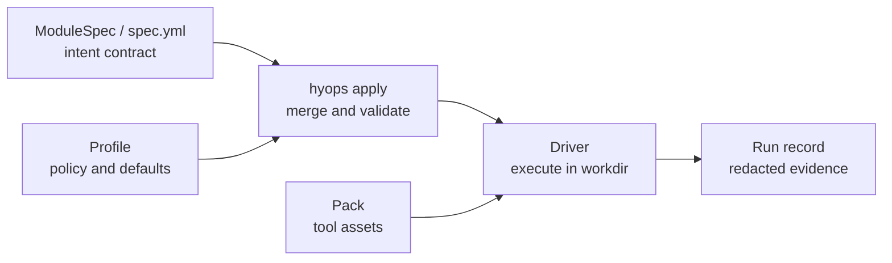

<h1 align="center">HybridOps Core</h1>

<p align="center">
  <strong>Run reproducible infrastructure across Proxmox, Hetzner, GCP, AWS, Azure, Kubernetes, Cloudflare, and local targets from a single CLI and a contract-driven module system.</strong>
</p>

<p align="center">
  <a href="LICENSE"></a>
  <a href="https://www.python.org/">= 3.11" src="https://img.shields.io/badge/python-%3E%3D3.11-blue"></a>
  <a href="https://github.com/hybridops-tech/hybridops-core/actions/workflows/ci.yml"></a>
</p>

<table align="center">
  <tr>
    <td align="center"><strong>72</strong><br><sub>runtime modules</sub></td>
    <td align="center"><strong>26</strong><br><sub>reference blueprints</sub></td>
    <td align="center"><strong>52</strong><br><sub>public decision records</sub></td>
    <td align="center"><strong>8</strong><br><sub>supported surfaces</sub></td>
  </tr>
</table>

---

## What this is

HybridOps Core is the automation runtime behind a hybrid infrastructure platform that runs across **Proxmox, Hetzner, GCP, AWS, Azure, Kubernetes, Cloudflare, and local** targets.

It acts as a contract-driven execution layer above tools such as **Terraform, Terragrunt, Ansible, and Packer**. It adds:

- **controlled execution:** how modules and blueprints are resolved and run
- **governance and preflight validation:** checks before an operation proceeds, including blueprint-level preflight before deploy execution
- **structured run records:** a non-secret record for every operation

Each module carries a declarative intent contract (`spec.yml`). A CLI (`hyops`) resolves the contract, selects a driver, executes it, and writes a structured run record. Blueprints sequence modules into repeatable multi-step deployments, evaluate required preflight checks before execution, and surface explicit confirmation when rerun or destructive risk is detected.

The platform is validated end to end, not just tested in isolation. Every scenario below has a recorded walkthrough.

## Proven scenarios

| Scenario | What it delivers |
|---|---|
| **[Authoritative on-prem foundation](https://docs.hybridops.tech/reference-scenarios/authoritative-onprem-foundation/)** | NetBox as IPAM + inventory source of truth, Proxmox SDN as the routed network baseline |
| **[PostgreSQL HA failover and failback](https://docs.hybridops.tech/reference-scenarios/postgresql-ha-dr-cycle/)** | Patroni + pgBackRest; GCP recovery in 12 min, controlled failback in 40 min |
| **[RKE2 HA platform foundation](https://docs.hybridops.tech/reference-scenarios/gitops-kubernetes-foundation/)** | Three-node RKE2 cluster + Argo CD GitOps delivery on Proxmox |
| **[Hybrid WAN edge and site extension](https://docs.hybridops.tech/reference-scenarios/hybrid-wan-edge-site-extension/)** | VyOS HA pair on Hetzner, BGP peering to GCP HA VPN, on-prem site extension |
| **[Managed PostgreSQL DR with Cloud SQL](https://docs.hybridops.tech/reference-scenarios/postgresql-managed-cloudsql-dr/)** | External replica standby on GCP, explicit promotion, controlled failback |
| **[Hybrid portal burst to GKE](https://docs.hybridops.tech/reference-scenarios/hybrid-portal-burst-gke/)** | Identity-gated workload burst from on-prem to GKE under load |
| **[Secret delivery pipeline](https://docs.hybridops.tech/reference-scenarios/secret-delivery-pipeline/)** | GCP Secret Manager to ESO to Kubernetes Secret on RKE2 and GKE |
| **[Governed network emulation](https://docs.hybridops.tech/reference-scenarios/eveng-lab-foundation/)** | EVE-NG as a managed lab platform on GCP (nested virtualisation) or Proxmox |

Walkthroughs, architecture diagrams, and platform-state captures for each scenario: **[docs.hybridops.tech/reference-scenarios](https://docs.hybridops.tech/reference-scenarios)**.

## Quick start

```bash
python3 -m venv .venv && . .venv/bin/activate
pip install .
```

Initialise a target environment:

```bash
hyops init proxmox --env dev
hyops init gcp --env dev
```

Run a module:

```bash
hyops apply --env dev --module platform/onprem/rke2-cluster
hyops apply --env dev --module org/gcp/project-factory
```

Run a full blueprint (ordered multi-step deployment):

```bash
hyops blueprint deploy --env dev --ref onprem/rke2@v1 --execute
```

The runtime root defaults to `~/.hybridops`. Override with `--root <path>` or `$HYOPS_RUNTIME_ROOT`.

## Execution model



The boundary is the point: module specs keep intent clean, profiles carry policy, packs carry implementation, and drivers produce reviewable evidence.

Blueprints sequence modules into repeatable deployments with explicit ordering, required preflight evaluation before execution, and confirmation prompts when rerun or destructive risk is detected.

Every `hyops` command writes a non-secret structured run record:

```
~/.hybridops/logs/module/<module_id>/<run_id>/
~/.hybridops/logs/init/<target>/<run_id>/
```

## Requirements

- Python ≥ 3.11
- Tool dependencies vary by module: `terraform`, `terragrunt`, `ansible`, `packer`, `gcloud`, `kubectl`; only the tools used by the modules you run need to be present

## Documentation

- **Full docs and reference scenarios:** [docs.hybridops.tech](https://docs.hybridops.tech)
- **Public site:** [hybridops.tech](https://hybridops.tech)
- **Security reports:** [security@hybridops.tech](mailto:security@hybridops.tech), see [SECURITY.md](.github/SECURITY.md)
- **Bugs and feature requests:** use the issue tracker

## License

[MIT-0](LICENSE)
