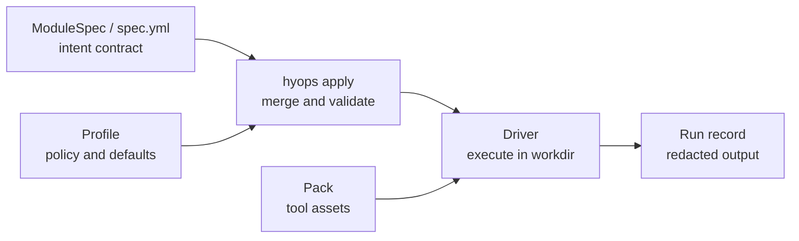

<h1 align="center">HybridOps Core</h1>

<p align="center">
  <strong>A contract-driven runtime for repeatable infrastructure execution across on-prem, cloud, Kubernetes, and local targets.</strong>
</p>

<p align="center">
  <a href="LICENSE"></a>
  <a href="https://www.python.org/">= 3.11" src="https://img.shields.io/badge/python-%3E%3D3.11-blue"></a>
  <a href="https://github.com/hybridops-tech/hybridops-core/actions/workflows/ci.yml"></a>
</p>

<table align="center">
  <tr>
    <td align="center"><strong>80</strong><br><sub>runtime modules</sub></td>
    <td align="center"><strong>28</strong><br><sub>reference blueprints</sub></td>
    <td align="center"><strong>52</strong><br><sub>public decision records</sub></td>
    <td align="center"><strong>8</strong><br><sub>supported targets</sub></td>
  </tr>
</table>

---

## What this is

HybridOps Core is the automation runtime behind a hybrid infrastructure platform that runs across **Proxmox, Hetzner, GCP, AWS, Azure, Kubernetes, Cloudflare, and local** targets.

It keeps module intent stable while drivers run versioned implementation packs,
profiles apply environment policy, preflight checks readiness, and each
operation produces a structured run record. It adds:

- **controlled execution:** how modules and blueprints are resolved and run
- **governance and preflight validation:** checks before an operation proceeds, including blueprint-level preflight before deploy execution
- **structured run records:** a non-secret record for every operation

Each module carries a declarative intent contract (`spec.yml`). A CLI (`hyops`) resolves the contract, selects a driver, executes it, and writes a structured run record. Blueprints sequence modules into repeatable multi-step deployments, evaluate required preflight checks before execution, and surface explicit confirmation when rerun or destructive risk is detected.

## Reference scenarios

HybridOps is exercised through complete reference scenarios rather than isolated
configuration examples. Each scenario connects architecture, operating
procedures, and run records across a tested platform path. The library includes
source-of-truth operations, Kubernetes platform foundations, hybrid WAN
extension, secret delivery, and disaster recovery.

Representative scenarios:

- **[Authoritative on-prem foundation](https://docs.hybridops.tech/reference-scenarios/authoritative-onprem-foundation/):** NetBox-backed source-of-truth operations and Proxmox SDN baseline
- **[PostgreSQL HA failover and failback](https://docs.hybridops.tech/reference-scenarios/postgresql-ha-dr-cycle/):** Patroni, pgBackRest, GCP recovery, and controlled failback
- **[RKE2 HA platform foundation](https://docs.hybridops.tech/reference-scenarios/gitops-kubernetes-foundation/):** RKE2 cluster foundation with GitOps delivery

The full reference scenario library is published at **[docs.hybridops.tech/reference-scenarios](https://docs.hybridops.tech/reference-scenarios)**.

## Quick start

Install the release package for your workstation:

| Platform | Installation |
|---|---|
| Linux | Extract the versioned archive and run `./install.sh` |
| macOS | Open the package for Apple silicon or Intel |
| Windows 11 | Extract the Windows ZIP and run `Install HybridOps.cmd` |

See the [Quickstart](https://docs.hybridops.tech/guides/getting-started/quickstart/)
for downloads, verification, and workstation setup.

Inspect a shipped blueprint before configuring a provider:

```bash
hyops blueprint validate --ref onprem/authoritative-foundation@v1
hyops blueprint plan --ref onprem/authoritative-foundation@v1
```

`validate` checks the blueprint manifest. `plan` validates the manifest and
prints the ordered steps. Neither command selects a runtime, invokes a driver,
or contacts the provider. See the
[authoritative foundation blueprint](blueprints/onprem/authoritative-foundation@v1/README.md)
for the complete operating sequence.

Initialise a target environment:

```bash
hyops init proxmox --env <env>
hyops init gcp --env <env>
```

After initialization, preflight resolves the environment, runtime, contracts,
credential requirements, state, and driver checks. Some module paths may inspect
live state, but preflight does not deploy resources:

```bash
hyops blueprint preflight --env <env> --ref onprem/authoritative-foundation@v1
```

Run a module:

```bash
hyops apply --env <env> --module platform/onprem/rke2-cluster
hyops apply --env <env> --module org/gcp/project-factory
```

Run a full blueprint (ordered multi-step deployment):

```bash
hyops blueprint deploy --env <env> --ref onprem/authoritative-foundation@v1 --execute
```

The runtime root defaults to `~/.hybridops`. Override with `--root <path>` or `$HYOPS_RUNTIME_ROOT`.

Check the installed release when required:

```bash
hyops update check
hyops update install
```

Core performs a cached, non-blocking release check during interactive use. The
check does not collect command or environment data and can be disabled with
`HYOPS_UPDATE_CHECK=0`. The published support policy can pause new mutating
operations when an installed release is no longer supported;
updates remain explicit, while destroy, recovery, access, and inspection stay
available.

## Execution model



This boundary keeps intent, policy, implementation, and execution records separate: module specs define intent, profiles carry policy, packs carry implementation assets, and drivers produce reviewable run records.

Blueprints sequence modules into repeatable deployments with explicit ordering, required preflight evaluation before execution, and confirmation prompts when rerun or destructive risk is detected.

Every `hyops` command writes a non-secret structured run record:

```
~/.hybridops/logs/module/<module_id>/<run_id>/
~/.hybridops/logs/init/<target>/<run_id>/
```

### Runtime retention and cleanup

The runtime root is local operator state, not repository content. HybridOps does
not impose a retention period: keep run records while they are needed for
debugging, audit, or handoff, then remove them according to the operator's own
retention policy.

For a local review, this command lists files under the default log directory
that are older than seven days without deleting them:

```bash
find ~/.hybridops/logs -type f -mtime +7 -print
```

Review the output before removing anything. Do not treat the whole runtime root
as disposable: `config/`, `credentials/`, `vault/`, `meta/`, and `state/` may
contain active or sensitive environment data. Never commit runtime logs,
credentials, vault material, private addresses, or unredacted evidence.

## Requirements

- Python ≥ 3.11
- Tool dependencies vary by module: `terraform`, `terragrunt`, `ansible`, `packer`, `gcloud`, `kubectl`; only the tools used by the modules you run need to be present

## Documentation

- **Full docs and reference scenarios:** [docs.hybridops.tech](https://docs.hybridops.tech)
- **Public site:** [hybridops.tech](https://hybridops.tech)
- **Contributing:** [CONTRIBUTING.md](CONTRIBUTING.md)
- **Security reports:** [security@hybridops.tech](mailto:security@hybridops.tech), see [SECURITY.md](.github/SECURITY.md)
- **Bugs and feature requests:** use the issue tracker
- **Reference model:** [Anuket CNTT](https://cntt.readthedocs.io/en/latest/common/chapter00.html)

## License

[MIT-0](LICENSE)
