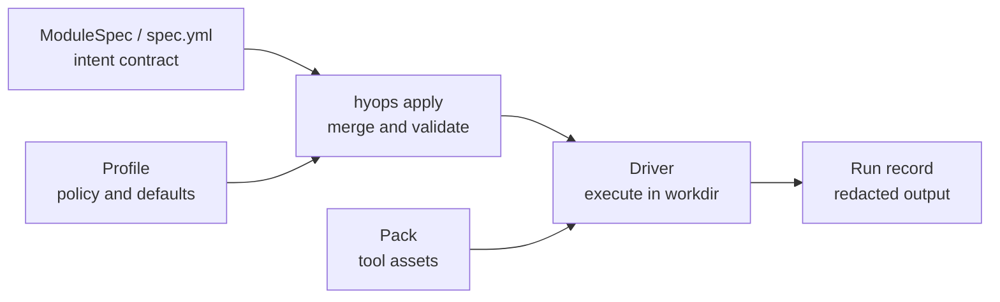

<h1 align="center">HybridOps Core</h1>

<p align="center">
  <strong>A contract-driven runtime for repeatable infrastructure execution across on-prem, cloud, Kubernetes, and local targets.</strong>
</p>

<p align="center">
  <a href="LICENSE"></a>
  <a href="https://www.python.org/">= 3.11" src="https://img.shields.io/badge/python-%3E%3D3.11-blue"></a>
  <a href="https://github.com/hybridops-tech/hybridops-core/actions/workflows/ci.yml"></a>
</p>

<table align="center">
  <tr>
    <td align="center"><strong>80</strong><br><sub>runtime modules</sub></td>
    <td align="center"><strong>28</strong><br><sub>reference blueprints</sub></td>
    <td align="center"><strong>52</strong><br><sub>public decision records</sub></td>
    <td align="center"><strong>8</strong><br><sub>supported targets</sub></td>
  </tr>
</table>

---

## What this is

HybridOps Core is the automation runtime behind a hybrid infrastructure platform that runs across **Proxmox, Hetzner, GCP, AWS, Azure, Kubernetes, Cloudflare, and local** targets.

It provides a stable operator boundary above the tools that perform the work. Module specs define intent, profiles carry environment policy, drivers adapt execution, packs contain versioned implementation assets, and the runtime records the result of each operation.

HybridOps does not replace Terraform, Terragrunt, Ansible, Packer, Kubernetes, cloud APIs, or application health mechanisms. Those remain execution surfaces beneath the runtime. The purpose of Core is to keep the operator-facing lifecycle consistent when an infrastructure operation crosses several of them.

Core adds:

- **controlled execution:** modules and blueprints resolve through one runtime path
- **governance and preflight validation:** required conditions are checked before dependent work proceeds
- **structured run records:** each operation produces a non-secret record with inputs, execution metadata, outputs, and redacted logs

Each module carries a declarative intent contract (`spec.yml`). A CLI (`hyops`) merges and validates runtime inputs, applies profile policy, selects a driver and pack, executes the operation, and writes a structured run record. Blueprints sequence modules into repeatable multi-step deployments, evaluate required preflight checks before execution, and require explicit confirmation when rerun or destructive risk is detected.

### Where the extra runtime boundary is useful

The runtime is intended for operations where ownership is split across tools or targets. Examples include a workflow that provisions infrastructure, configures services, publishes state, validates health, and records recovery or teardown outcomes across different systems.

If one existing control plane already owns the complete lifecycle, adding HybridOps may provide little value. A single Terraform stack, a self-contained Kubernetes operator, or a provider-native workflow can be the better boundary when it already provides the required policy, lifecycle, and evidence model.

The design question is therefore not whether contracts, validation, state, or health checks already exist. They do. The question is whether a common operator contract across heterogeneous execution surfaces reduces lifecycle-specific glue without hiding the systems that remain authoritative.

## Reference scenarios

HybridOps is exercised through complete reference scenarios rather than isolated configuration examples. Each scenario connects architecture, operating procedures, and run records across a tested platform path. The library includes source-of-truth operations, Kubernetes platform foundations, hybrid WAN extension, secret delivery, and disaster recovery.

Representative scenarios:

- **[Authoritative on-prem foundation](https://docs.hybridops.tech/reference-scenarios/authoritative-onprem-foundation/):** NetBox-backed source-of-truth operations and Proxmox SDN baseline
- **[PostgreSQL HA failover and failback](https://docs.hybridops.tech/reference-scenarios/postgresql-ha-dr-cycle/):** Patroni, pgBackRest, GCP recovery, and controlled failback
- **[RKE2 HA platform foundation](https://docs.hybridops.tech/reference-scenarios/gitops-kubernetes-foundation/):** RKE2 cluster foundation with GitOps delivery

The full reference scenario library is published at **[docs.hybridops.tech/reference-scenarios](https://docs.hybridops.tech/reference-scenarios)**.

## Quick start

For installation, workstation setup, target initialisation, and first-run guidance, see the [Quickstart](https://docs.hybridops.tech/guides/getting-started/quickstart/).

Inspect a shipped blueprint locally:

```bash
hyops blueprint validate --ref onprem/authoritative-foundation@v1
hyops blueprint plan --ref onprem/authoritative-foundation@v1
```

These commands validate and plan the formation without contacting a provider. See the [authoritative foundation blueprint](blueprints/onprem/authoritative-foundation@v1/) or browse the [Blueprint Index](https://docs.hybridops.tech/platform/blueprints/).

## Execution model


```mermaid
flowchart LR
    spec["ModuleSpec / spec.yml<br/>intent contract"]
    cli["hyops apply<br/>merge and validate"]
    driver["Driver<br/>execute in workdir"]
    record["Run record<br/>redacted output"]
    profile["Profile<br/>policy and defaults"]
    pack["Pack<br/>tool assets"]

    spec --> cli
    profile --> cli
    cli --> driver
    pack --> driver
    driver --> record
```

This boundary keeps intent, policy, implementation, and execution records separate: module specs define intent, profiles carry policy, packs carry implementation assets, and drivers produce reviewable run records.

Blueprints sequence modules into repeatable deployments with explicit ordering, required preflight evaluation before execution, and confirmation prompts when rerun or destructive risk is detected.

Every `hyops` command writes a non-secret structured run record:

```
~/.hybridops/logs/module/<module_id>/<run_id>/
~/.hybridops/logs/init/<target>/<run_id>/
```

## Requirements

- Python >= 3.11
- Tool dependencies vary by module: `terraform`, `terragrunt`, `ansible`, `packer`, `gcloud`, `kubectl`; only the tools used by the modules you run need to be present

## Research and external review

HybridOps Core is the public reference implementation for ongoing research in platform engineering and infrastructure automation.

See [Research and External Review](RESEARCH.md) for published papers, implementation maps, and external technical reviews.

## Documentation

- **Full docs and reference scenarios:** [docs.hybridops.tech](https://docs.hybridops.tech)
- **Public site:** [hybridops.tech](https://hybridops.tech)
- **Contributing:** [CONTRIBUTING.md](CONTRIBUTING.md)
- **Security reports:** [security@hybridops.tech](mailto:security@hybridops.tech), see [SECURITY.md](.github/SECURITY.md)
- **Bugs and feature requests:** use the issue tracker
- **Reference model:** [Anuket CNTT](https://cntt.readthedocs.io/en/latest/common/chapter00.html)

## License

[MIT-0](LICENSE)
