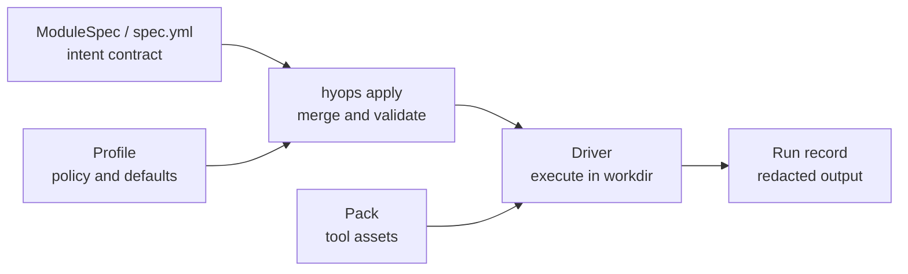

<h1 align="center">HybridOps Core</h1>

<p align="center">
  <strong>A contract-driven runtime for repeatable infrastructure execution across on-prem, cloud, Kubernetes, and local targets.</strong>
</p>

<p align="center">
  <a href="LICENSE"></a>
  <a href="https://www.python.org/">= 3.11" src="https://img.shields.io/badge/python-%3E%3D3.11-blue"></a>
  <a href="https://github.com/hybridops-tech/hybridops-core/actions/workflows/ci.yml"></a>
</p>

<table align="center">
  <tr>
    <td align="center"><strong>80</strong><br><sub>runtime modules</sub></td>
    <td align="center"><strong>28</strong><br><sub>reference blueprints</sub></td>
    <td align="center"><strong>52</strong><br><sub>public decision records</sub></td>
    <td align="center"><strong>8</strong><br><sub>supported targets</sub></td>
  </tr>
</table>

---

## What this is

HybridOps Core provides one operator contract for infrastructure lifecycles across **Proxmox, Hetzner, GCP, AWS, Azure, Kubernetes, Cloudflare, and local** targets.

Module specs define intent. Profiles carry environment policy. Drivers adapt execution. Packs contain versioned implementation assets. Blueprints compose modules into dependency-aware operations. The runtime validates the resolved contract, performs preflight, executes the selected implementation, publishes outputs, and writes a structured run record.

Terraform, Terragrunt, Ansible, Packer, Kubernetes tooling, provider CLIs, and APIs integrate through the runtime rather than defining the operator workflow themselves.

Core standardises:

- **contract resolution:** deterministic input merge, validation, dependency ordering, and environment policy
- **controlled execution:** driver-based dispatch through versioned implementation packs and isolated workdirs
- **preflight and verification:** required conditions and module probes around execution
- **run records:** non-secret execution records with metadata, outputs, and redacted logs

## Reference scenarios

HybridOps is exercised through complete platform paths rather than isolated configuration examples.

- **[Authoritative on-prem foundation](https://docs.hybridops.tech/reference-scenarios/authoritative-onprem-foundation/):** NetBox-backed source-of-truth operations and Proxmox SDN baseline
- **[PostgreSQL HA failover and failback](https://docs.hybridops.tech/reference-scenarios/postgresql-ha-dr-cycle/):** Patroni, pgBackRest, GCP recovery, and controlled failback
- **[RKE2 HA platform foundation](https://docs.hybridops.tech/reference-scenarios/gitops-kubernetes-foundation/):** RKE2 cluster foundation with GitOps delivery

See the full [reference scenario library](https://docs.hybridops.tech/reference-scenarios/).

## Quick start

For installation, workstation setup, target initialisation, and first-run guidance, see the [Quickstart](https://docs.hybridops.tech/guides/getting-started/quickstart/).

Inspect a shipped blueprint locally:

```bash
hyops blueprint validate --ref onprem/authoritative-foundation@v1
hyops blueprint plan --ref onprem/authoritative-foundation@v1
```

See the [authoritative foundation blueprint](blueprints/onprem/authoritative-foundation@v1/) or browse the [Blueprint Index](https://docs.hybridops.tech/platform/blueprints/).

## Execution model


```mermaid
flowchart LR
    spec["ModuleSpec / spec.yml<br/>intent contract"]
    cli["hyops apply<br/>merge and validate"]
    driver["Driver<br/>execute in workdir"]
    record["Run record<br/>redacted output"]
    profile["Profile<br/>policy and defaults"]
    pack["Pack<br/>tool assets"]

    spec --> cli
    profile --> cli
    cli --> driver
    pack --> driver
    driver --> record
```

This boundary keeps intent, policy, implementation, and execution records separate. Blueprints add explicit ordering, required preflight evaluation, and guarded lifecycle operations around the same runtime path.

Run records are written under stable paths such as:

```text
~/.hybridops/logs/module/<module_id>/<run_id>/
~/.hybridops/logs/init/<target>/<run_id>/
```

## Requirements

- Python >= 3.11
- Tool dependencies vary by module: `terraform`, `terragrunt`, `ansible`, `packer`, `gcloud`, `kubectl`

## Research and external review

HybridOps Core is the public reference implementation for ongoing work in platform engineering and infrastructure automation.

See [Research and External Review](RESEARCH.md) for published papers, implementation maps, and external technical reviews.

## Documentation

- **Full docs and reference scenarios:** [docs.hybridops.tech](https://docs.hybridops.tech)
- **Public site:** [hybridops.tech](https://hybridops.tech)
- **Contributing:** [CONTRIBUTING.md](CONTRIBUTING.md)
- **Security:** [SECURITY.md](.github/SECURITY.md)
- **Reference model:** [Anuket CNTT](https://cntt.readthedocs.io/en/latest/common/chapter00.html)

## License

[MIT-0](LICENSE)
