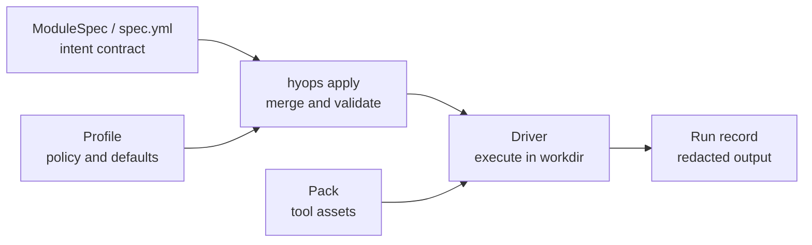

<h1 align="center">HybridOps Core</h1>

<p align="center">
  <strong>A contract-driven runtime for repeatable infrastructure execution across on-prem, cloud, Kubernetes, and local targets.</strong>
</p>

<p align="center">
  <a href="LICENSE"></a>
  <a href="https://www.python.org/">= 3.11" src="https://img.shields.io/badge/python-%3E%3D3.11-blue"></a>
  <a href="https://github.com/hybridops-tech/hybridops-core/actions/workflows/ci.yml"></a>
</p>

<table align="center">
  <tr>
    <td align="center"><strong>80</strong><br><sub>runtime modules</sub></td>
    <td align="center"><strong>28</strong><br><sub>reference blueprints</sub></td>
    <td align="center"><strong>52</strong><br><sub>public decision records</sub></td>
    <td align="center"><strong>8</strong><br><sub>supported targets</sub></td>
  </tr>
</table>

---

## What this is

HybridOps Core is the automation runtime behind a hybrid infrastructure platform that runs across **Proxmox, Hetzner, GCP, AWS, Azure, Kubernetes, Cloudflare, and local** targets.

It keeps module intent stable while drivers run versioned implementation packs,
profiles apply environment policy, preflight checks readiness, and each
operation produces a structured run record. It adds:

- **controlled execution:** how modules and blueprints are resolved and run
- **governance and preflight validation:** checks before an operation proceeds, including blueprint-level preflight before deploy execution
- **structured run records:** a non-secret record for every operation

Each module carries a declarative intent contract (`spec.yml`). A CLI (`hyops`) resolves the contract, selects a driver, executes it, and writes a structured run record. Blueprints sequence modules into repeatable multi-step deployments, evaluate required preflight checks before execution, and surface explicit confirmation when rerun or destructive risk is detected.

## Reference scenarios

HybridOps is exercised through complete reference scenarios rather than isolated
configuration examples. Each scenario connects architecture, operating
procedures, and run records across a tested platform path. The library includes
source-of-truth operations, Kubernetes platform foundations, hybrid WAN
extension, secret delivery, and disaster recovery.

Representative scenarios:

- **[Authoritative on-prem foundation](https://docs.hybridops.tech/reference-scenarios/authoritative-onprem-foundation/):** NetBox-backed source-of-truth operations and Proxmox SDN baseline
- **[PostgreSQL HA failover and failback](https://docs.hybridops.tech/reference-scenarios/postgresql-ha-dr-cycle/):** Patroni, pgBackRest, GCP recovery, and controlled failback
- **[RKE2 HA platform foundation](https://docs.hybridops.tech/reference-scenarios/gitops-kubernetes-foundation/):** RKE2 cluster foundation with GitOps delivery

The full reference scenario library is published at **[docs.hybridops.tech/reference-scenarios](https://docs.hybridops.tech/reference-scenarios)**.

## Quick start

For installation, workstation setup, target initialisation, and first-run guidance,
see the [Quickstart](https://docs.hybridops.tech/guides/getting-started/quickstart/).

Inspect a shipped blueprint locally:

```bash
hyops blueprint validate --ref onprem/authoritative-foundation@v1
hyops blueprint plan --ref onprem/authoritative-foundation@v1
```

These commands validate and plan the formation without contacting a provider.
See the [authoritative foundation blueprint](blueprints/onprem/authoritative-foundation@v1/)
or browse the [Blueprint Index](https://docs.hybridops.tech/platform/blueprints/).

## Execution model


```mermaid
flowchart LR
    spec["ModuleSpec / spec.yml<br/>intent contract"]
    cli["hyops apply<br/>merge and validate"]
    driver["Driver<br/>execute in workdir"]
    record["Run record<br/>redacted output"]
    profile["Profile<br/>policy and defaults"]
    pack["Pack<br/>tool assets"]

    spec --> cli
    profile --> cli
    cli --> driver
    pack --> driver
    driver --> record
```

This boundary keeps intent, policy, implementation, and execution records separate: module specs define intent, profiles carry policy, packs carry implementation assets, and drivers produce reviewable run records.

Blueprints sequence modules into repeatable deployments with explicit ordering, required preflight evaluation before execution, and confirmation prompts when rerun or destructive risk is detected.

Every `hyops` command writes a non-secret structured run record:

```
~/.hybridops/logs/module/<module_id>/<run_id>/
~/.hybridops/logs/init/<target>/<run_id>/
```

## Requirements

- Python ≥ 3.11
- Tool dependencies vary by module: `terraform`, `terragrunt`, `ansible`, `packer`, `gcloud`, `kubectl`; only the tools used by the modules you run need to be present

## Research and external review

HybridOps Core is the public reference implementation for ongoing research in
platform engineering and infrastructure automation.

See [Research and External Review](RESEARCH.md) for published papers,
implementation maps, and external technical reviews.

## Documentation

- **Full docs and reference scenarios:** [docs.hybridops.tech](https://docs.hybridops.tech)
- **Public site:** [hybridops.tech](https://hybridops.tech)
- **Contributing:** [CONTRIBUTING.md](CONTRIBUTING.md)
- **Security reports:** [security@hybridops.tech](mailto:security@hybridops.tech), see [SECURITY.md](.github/SECURITY.md)
- **Bugs and feature requests:** use the issue tracker
- **Reference model:** [Anuket CNTT](https://cntt.readthedocs.io/en/latest/common/chapter00.html)

## License

[MIT-0](LICENSE)
